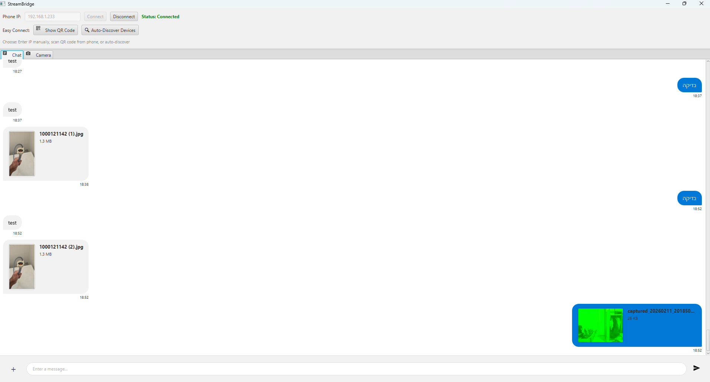
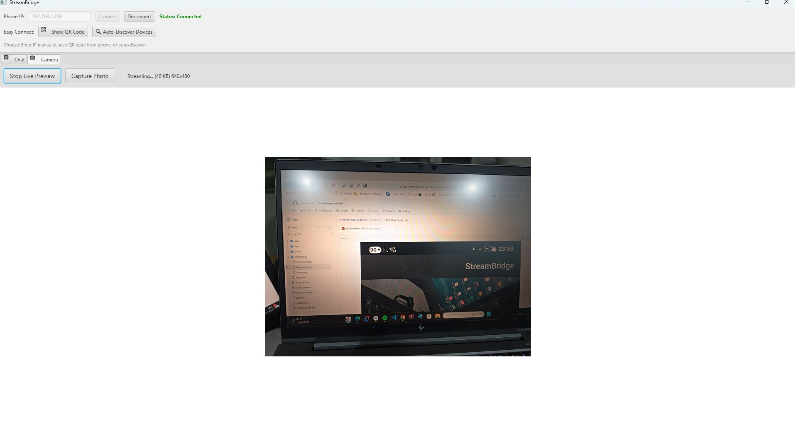

# StreamBridge – Windows Client

StreamBridge is a secure real-time communication system that connects an Android phone with a Windows PC over a local network (LAN).

This repository contains the **Windows desktop client**, written in **Kotlin + JavaFX**.  
The desktop application connects to the Android server, receives live camera streams, messages, and files, And can remotely control certain phone functions, such as taking photos via the computer using the phone.

---

## 📸 Screenshots

| Chat Screen | Live Camera Screen |
|---|---|
|  |  |

---

## Features

- 📷 **Live camera streaming** from the phone to the PC
- 💬 **Bidirectional real-time messaging**
- 📁 **Secure file transfer** between phone and PC
- 📸 **Instant photo reception** after remote capture
-  🔍 **Auto-discovery of devices over LAN**
- 🔒 **Secure communication over HTTPS (port 8080) and WebSocket Secure (port 8081)**
- 🔐 **Strong encryption**
  - TLS 1.3
  - ECDHE used for key exchange — generates session encryption keys and provides forward secrecy
  - ECDSA authentication
  - AES-256-GCM encryption
- 🤝 **Secure first-time pairing (TOFU – Trust On First Use)**

---

## 🧠 Highlights & Mechanics

- **Client–Server Architecture**
  - Android phone acts as the **secure server**
  - Windows desktop application acts as the **client**

- **Secure Communication Pipeline**
  1. Client connects to the phone via HTTPS
  2. WebSocket Secure (WSS) channel is established
  3. Server identity is verified using a pinned certificate (ECDSA)
  4. Key exchange is performed using ECDHE
  5. All messages and media streams are encrypted using AES-256-GCM

- **Device Discovery**
  - Automatic discovery using **mDNS / JmDNS**
  - Manual connection via **QR code pairing**

- **TOFU Pairing Model**
  - On first connection, the client stores the phone’s certificate
  - Future connections verify against the stored certificate
  - Any certificate change is treated as suspicious and blocked
 
- **Real-Time Interaction**
  - Receive live camera stream
  - Send commands to capture photos
  - Send and receive messages
  - Transfer files
 
### Use Cases

- View phone camera live from computer and take photos from  computer
- Receive photos instantly after capture on phone
- Transfer files securely without cloud services
- Real-time phone–PC communication

---

## Architecture

StreamBridge uses a **client–server architecture over LAN** — no internet connection or cloud service required.

Android Phone (Server) <-- HTTPS / WSS --> Windows PC (Client)  

Camera / Files / Messages                Desktop UI

Phone (Android app):

Runs a local HTTPS server using NanoHTTPD
Provides WebSocket secure (WSS) communication
Streams camera frames
Handles file transfer and commands
PC (Windows client):

Desktop application built with Kotlin + JavaFX
Connects to the phone over the local network
Renders live video frames
Handles file downloads/uploads and messaging UI

---

## Security

StreamBridge is designed with strong security principles.

### Transport Security

All communication occurs over **HTTPS and WSS** and encrypted using **TLS**.

This ensures:

- encrypted communication
- message integrity
- protection from man-in-the-middle attacks

### Authentication

Authentication is performed using **ECDSA** certificates generated on the phone and verified by the client.

### Key exchange

Key exchange is performed using **ECDHE**, ensuring:

- perfect forward secrecy
- new session keys for every connection

### Data Encryption

Sensitive data is protected with **AES-256-GCM**, providing:

- strong encryption
- authenticated encryption
- tamper protection

### Pairing model

StreamBridge uses **TOFU (Trust On First Use)**.

This means:

- On first connection the PC receives the phone's self-signed certificate and pins it locally
- Every subsequent connection verifies against the pinned certificate — a rogue device on the network cannot impersonate the phone
- Pairing is initiated either by scanning a QR code or via an Auto-Discover prompt that requires explicit acceptance on the phone
- This model is similar to how **SSH** works.

---

## Technologies Used

- **Kotlin**- primary language
- **JavaFX** – desktop UI framework
- **HTML**- Create a contact file
- **OkHttp** – HTTPS and WebSocket client
- **java-WebSocket Secure (WSS)**
- **HTTPS**
- **JmDNS / mDNS** - local network discovery
- **TLS**
- **ECDHE**
- **ECDSA**
- **AES-256-GCM**

---

## 📂 Project Structure

src/
├── main/
│ ├── kotlin/dev/streambridge/
│ │ 
│ │ ├── MainApp.kt
│ │ ├── AppIcons.kt
│ │ │
│ │ ├── network/
│ │ │ ├── ConnectionManager.kt
│ │ │ └── QRCodeGenerator.kt
│ │ │
│ │ ├── discovery/
│ │ │ └── DiscoveryManager.kt
│ │ │
│ │ ├── streaming/
│ │ │ └── CameraView.kt
│ │ │
│ │ ├── transfer/
│ │ │ ├── FileExplorer.kt
│ │ │ └── ChatData.kt
│ │ │
│ │ ├── security/
      └── CertStore.kt 

---

## First-time pairing

1. Start the StreamBridge app on your phone — the server starts automatically

2. On the Windows client, click **Show QR Code** and scan it with the phone, or click **Auto-Discover Devices**

3. Accept the connection prompt on the phone — the certificate is pinned and all future connections are automatic

---

## Project Status

This project was developed as a personal software project demonstrating:

- desktop networking with Kotlin and JavaFX
- secure communication protocols
- real-time media streaming
- cross-platform phone–desktop integration

---

## Related Project

The Android server application is implemented separately and is required for this client to function.

  
